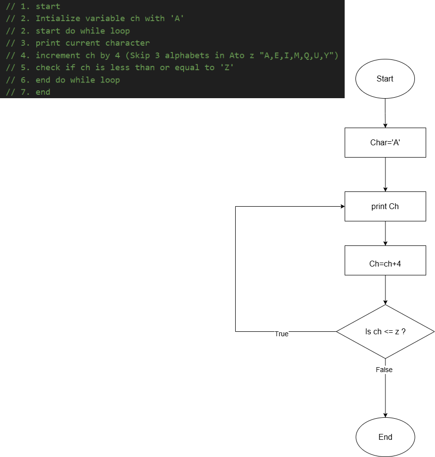
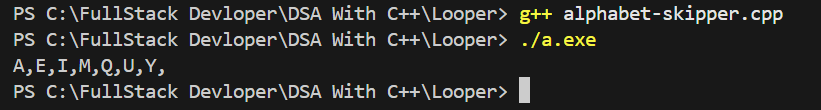
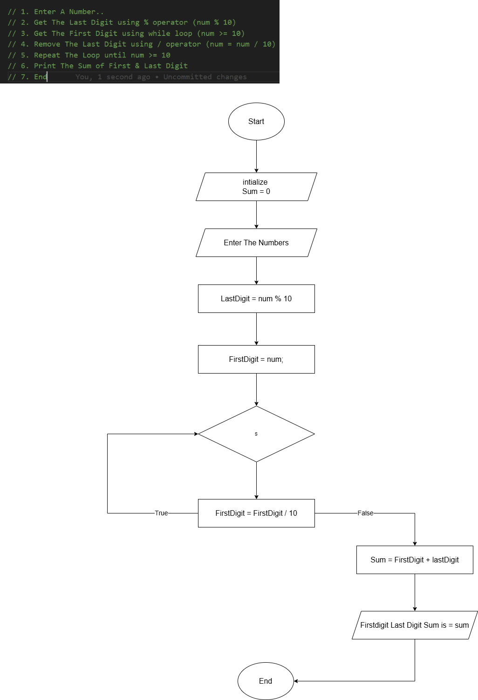
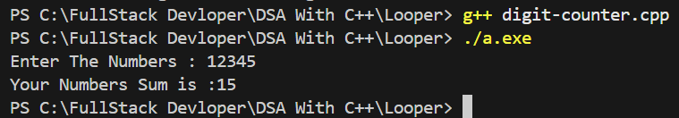
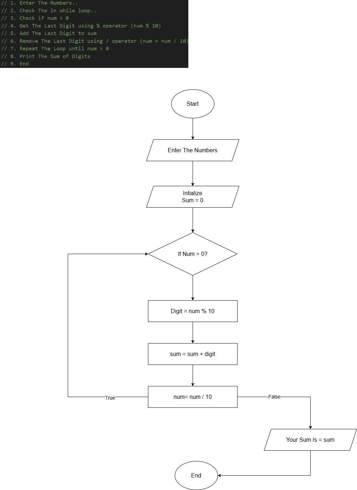

# 1. Alphabet Skipper

To print a sequence of uppercase alphabets starting from 'A', skipping 3 letters every time (i.e., add 4 to the character value).

###  Logic:
- Start with character `A`.
- Use a `do-while` loop to print the character.
- Increment character by 4 in each iteration.
- Continue the loop until the character is less than or equal to `Z`.

###  Algorithm:
1. Start
2. Initialize `ch` with `'A'`
3. Start `do-while` loop
4. Print current value of `ch`
5. Increment `ch` by 4
6. Repeat until `ch <= 'Z'`
7. End

## Flowchart

Below is an actual run of the program in the terminal:



### Code:
```cpp
#include<iostream>
using namespace std;

int main(){
    char ch = 'A';

    do {
        cout << ch << ",";
        ch = ch + 4;

    } while (ch <= 'Z');

      return 0;
}
```


## Output Screenshot

Below is an actual run of the program in the terminal:




# 2. Digit Counter 

Sum of First and Last Digit of a Number

To take an integer input from the user, extract the **first** and **last** digit, and print their **sum**.

---

### Logic:
- Use `% 10` to get the **last digit**.
- Use a `while` loop and keep dividing by `10` to reach the **first digit**.
- Add both digits and display the result.

---

### Algorithm:
1. Start
2. Input a number `num`
3. Extract last digit: `LastDigit = num % 10`
4. Copy `num` to `FirstDigit`
5. Run `while (FirstDigit >= 10)`:
   - `FirstDigit = FirstDigit / 10`
6. Add `FirstDigit + LastDigit` to get the sum
7. Display result
8. End

## Flowchart

Below is an actual run of the program in the terminal:



### Code:
```cpp
#include<iostream>
using namespace std;

int main(){
    int num, LastDigit, FirstDigit;
    int sum = 0;

    cout << "Enter A Number : ";
    cin >> num;

    LastDigit = num % 10;

    FirstDigit = num;

    while (FirstDigit >= 10)
    {   
        FirstDigit = FirstDigit / 10;
    }

    sum = FirstDigit + LastDigit;

    cout << "Sum of First Digit " << FirstDigit 
         << " & Last digit " << LastDigit 
         << " is: " << sum << endl;

    return 0;
}
```

## Output Screenshot

Below is an actual run of the program in the terminal:




# 3. Digit Addition

 Sum of Digits of a Number

##  Objective:
To take a number from the user and calculate the **sum of its individual digits** using a loop.

---

### Logic:
- Use `% 10` to extract each digit from right to left.
- Add each digit to a running `sum`.
- Use `/ 10` to remove the last digit after each iteration.

---

### Algorithm:
1. Start
2. Input a number `num`
3. Initialize `sum = 0`
4. Use `while (num > 0)`:
   - Get last digit: `digit = num % 10`
   - Add digit to sum: `sum = sum + digit`
   - Remove digit: `num = num / 10`
5. Print the sum
6. End

## Flowchart

Below is an actual run of the program in the terminal:




### Code:
```cpp
#include<iostream>
using namespace std;

int main(){
    int num, sum = 0;
    int digit;

    cout << "Enter The Numbers : ";
    cin >> num;
    
    while (num > 0)
    {
        digit = num % 10;
        sum = sum + digit;
        num = num / 10;
    }
    cout << "Your Numbers Sum is : " << sum << endl;
    return 0;
}
```
## Output Screenshot

Below is an actual run of the program in the terminal:


