# Project 11 : Categorizing (Linkedlist & Sorting & Searching)

This is a C++ console-based application that demonstrates **Data Structures** and **Algorithms** using Object-Oriented Programming (OOP).  
It provides an interactive menu to perform operations on:

-  **Singly Linked List (CRUD)**
-  **Sorting Algorithms (Quick Sort, Merge Sort)**
-  **Searching Algorithms (Linear, Binary)**

---

---

## ✨ Features

| Module        | Description |
|---------------|-------------|
|  Linked List | Insert, delete, update, and view elements dynamically |
|  Sorting     | Sort arrays using Quick Sort and Merge Sort |
|  Searching   | Search elements using Linear and Binary Search |
|  Interactive | Menu-driven interface with input validation and success messages |

---

## 📌 Overview

This project is built using **classes and objects** in C++. It provides a hands-on experience with:

- Pointers and dynamic memory
- Recursive sorting algorithms
- Searching in both sorted and unsorted arrays
- Singly Linked List operations

This makes it ideal for beginners learning DSA in C++.


## 📊 Algorithms Used

### 🔸 Merge Sort (Divide & Conquer)
- Recursively divides the array in half
- Merges sorted halves
- Time Complexity: `O(n log n)`

### 🔸 Quick Sort (Divide & Conquer)
- Selects pivot and partitions array
- Recursively sorts left and right halves
- Time Complexity: `O(n log n)` (avg), `O(n²)` (worst)

### 🔸 Linear Search
- Iterates over each element
- Works on **unsorted arrays**

### 🔸 Binary Search
- Efficient search in **sorted arrays only**
- Uses divide and conquer
- Time Complexity: `O(log n)`

---

## 🔧 Functions Breakdown

### 🔹 Linked List Class (`linkedlist`)

| Function Name            | Description |
|--------------------------|-------------|
| `insertAtBeginning(ele)` | Inserts a node at the start |
| `insertAtEnding(ele)`    | Inserts a node at the end |
| `inerstAtAnyPosition(ele, pos)` | Inserts at specific position |
| `updateAtAnyPosition(pos, ele)` | Updates the value at given position |
| `deleteAtBegining()`     | Deletes first node |
| `deleteAtEnding()`       | Deletes last node |
| `deleteAtAnyPosition(pos)` | Deletes node at given position |
| `viewList()`             | Displays the linked list |

### 🔹 Sorting Class (`Sorting`)

| Function Name       | Description |
|---------------------|-------------|
| `mergeSort(arr, l, r)` | Recursively sorts using Merge Sort |
| `quickSort(arr, l, r)` | Recursively sorts using Quick Sort |
| `merge(...)`        | Helper for merge sort |
| `partition(...)`    | Helper for quick sort |
| `isSorted(arr)`     | Checks if array is already sorted |
| `display(arr)`      | Prints the array |

### 🔹 Searching Class (`Searching`)

| Function Name       | Description |
|---------------------|-------------|
| `linearSearch(arr, size, key)` | Searches using linear search |
| `binarySearch(arr, size, key)` | Searches using binary search |
| `isSorted(arr)`     | Checks if array is sorted before binary search |

---

## 🚀 How to Run

### 🖥️ Step-by-step:

1. Clone this repo or download the `.cpp` file
2. Open in your preferred C++ IDE (CodeBlocks / VSCode)
3. Compile and Run the file

### 📌 For terminal/CLI:
```bash
g++ main.cpp -o ds_project
./ds_project
 ```
---

## Our Code

```cpp

#include <iostream>
using namespace std;

class Node
{
public:
    int data;
    Node *next;
};

class linkedlist
{
public:
    Node *Head = NULL;
    int count, position;

    linkedlist()
    {
        Head = NULL;
        count = 0;
    }

    void insertAtBeginning(int ele)
    {
        Node *newNode = new Node();

        newNode->data = ele;
        newNode->next = Head;
        Head = newNode;
        this->count++;
        cout << "Element Added " << ele << " At Begining Sucessfully..." << endl;
    }

    void insertAtEnding(int ele)
    {

        Node *newNode = new Node();

        newNode->data = ele;
        newNode->next = NULL;

        if (Head == NULL)
        {
            Head = newNode;
        }
        else
        {
            Node *ptr = Head;
            while (ptr->next != NULL)
            {
                ptr = ptr->next;
            }
            ptr->next = newNode;
        }
        cout << "Element Added " << ele << " At Ending Sucessfully..." << endl
             << endl;
        this->count++;
    }
    void inerstAtAnyPosition(int ele, int position)
    {

        if (position < 0 || position > count)
        {
            cout << "Invalid Postion... please enter between (0 to " << count << ")" << endl;
            return;
        }
        Node *newNode = new Node();

        if (position == 0)
        {
            newNode->data = ele;
            newNode->next = Head;
            Head = newNode;
            cout << "Element Added " << ele << " At (head)" << endl;
        }
        else
        {
            Node *ptr = Head;

            for (int i = 0; i < position - 1; i++)
            {
                ptr = ptr->next;
            }
            newNode->next = ptr->next;
            ptr->next = newNode;
            cout << "Element " << ele << " inerted At Position " << position << " successfully." << endl;
        }

        this->count++;
    }
    void updateAtAnyPosition(int position, int ele)
    {

        if (Head == NULL)
        {
            cout << "Your LinkedList Is Empty...." << endl;
        }
        Node *newNode = new Node();
        if (position == 0)
        {
            newNode->data = ele;
            newNode->next = Head;
            Head = newNode;
            cout << "Element Added " << ele << "  At (head)" << endl;
        }
        else
        {
            Node *ptr = Head;

            for (int i = 0; i < position; i++)
            {
                ptr = ptr->next;
            }
            ptr->data = ele;
        }
        cout << "Element at position " << position << " updated to " << ele << " successfully." << endl;
    }
    void deleteAtBegining()
    {
        Node *temp;

        temp = Head;
        Head = Head->next;
        cout << temp->data << endl;
        delete temp;
        temp = NULL;

        count--; 
        cout << "Element Deleted At begining Sucessfully..." << endl;
    }
    void deleteAtEnding()
    {
        Node *ptr = Head;

        while (ptr->next->next != NULL)
        {
            ptr = ptr->next;
        }
        cout << ptr->next->data << endl;
        delete ptr->next;
        ptr->next = NULL;
        count--; 
        cout << "Element Deleted At Ending Sucessfully..." << endl;
    }
    void deleteAtAnyPosition(int position)
    {

        if (Head == NULL)
        {
            cout << "List is empty. Nothing to delete." << endl;
            return;
        }

        if (position < 0 || position >= count)
        {
            cout << "Invalid position. Please enter between 0 to " << count - 1 << endl;
            return;
        }

        if (position == 0)
        {
            Node *temp = Head;
            cout << "Deleted element: " << temp->data << endl;
            Head = Head->next;
            delete temp;
            count--;
            return;
        }
        Node *prev = Head;
        Node *current = Head;

        for (int i = 0; i < position; i++)
        {
            current = current->next;
        }
        for (int i = 0; i < position - 1; i++)
        {
            prev = prev->next;
        }
        cout << "Deleted element: " << current->data << endl;
        prev->next = current->next;
        delete current;
        current = NULL;
    }
    void viewList()
    {

        Node *ptr = Head;

        if (ptr == NULL)
        {
            cout << "Your List Is Empty ... " << endl;
        }
        else
        {
            while (ptr != NULL)
            {
                cout << ptr->data << " ";
                ptr = ptr->next;
            }
        }

        cout << endl;
    }
};

class Sorting
{
public:
    void merge(int arr[], int low, int mid, int high)
    {

        int left = mid - low + 1;
        int right = high - mid;

        int a[left], b[right];

        for (int i = 0; i < left; i++)
        {
            a[i] = arr[low + i];
        }
        for (int i = 0; i < right; i++)
        {
            b[i] = arr[(mid + 1) + i];
        }

        int i = 0, j = 0, k = low;

        while (i < left && j < right)
        {
            if (a[i] < b[j])
            {
                arr[k++] = a[i++];
            }
            else
            {
                arr[k++] = b[j++];
            }
        }
        while (i < left)
        {
            arr[k++] = a[i++];
        }
        while (j < right)
        {
            arr[k++] = b[j++];
        }
    };
    void mergeSort(int arr[], int low, int high)
    {
        if (low < high)
        {
            int mid = (low + high) / 2;

            mergeSort(arr, low, mid);

            mergeSort(arr, mid + 1, high);

            merge(arr, low, mid, high);
        }
    };
    bool isSorted(int arr[], int size)
    {
        for (int i = 0; i < size - 1; i++)
        {
            if (arr[i] > arr[i + 1])
            {
                return false;
            }
        }
        return true;
    };
    int partition(int arr[], int low, int high)
    {
        int pivot = arr[low];
        int i = low + 1;
        int j = high;

        while (i <= j)
        {
            while (i <= high && arr[i] <= pivot)
            {
                i++;
            }
            while (j >= low && arr[j] > pivot)
            {
                j--;
            }
            if (i < j)
            {
                int temp = arr[i];
                arr[i] = arr[j];
                arr[j] = temp;
            }
        }
        int temp = arr[low];
        arr[low] = arr[j];
        arr[j] = temp;

        return j;
    };

    void quickSort(int arr[], int low, int high)
    {

        if (low < high)
        {

            int pi = partition(arr, low, high);

            quickSort(arr, low, pi - 1);

            quickSort(arr, pi + 1, high);
        }
    };

    void display(int arr[], int size)
    {
        cout << "Your Array Is : ";

        for (int i = 0; i < size; i++)
        {
            cout << arr[i] << " ";
        }
        cout << endl;
    }
};

class Searching
{
public:
    bool isSorted(int arr[], int size)
    {
        for (int i = 0; i < size - 1; i++)
        {
            if (arr[i] > arr[i + 1])
            {
                return false;
            }
        }
        return true;
    };
    void binarySearch(int arr[], int size, int key)
    {

        if (!isSorted(arr, size))
        {
            cout << "Array is not sorted. Please sort the array before using Binary Search." << endl;
            return;
        }

        int low = 0, high = size - 1;

        while (low <= high)
        {
            int mid = (low + high) / 2;

            if (arr[mid] == key)
            {
                cout << "Element " << arr[mid] << " found at index " << mid << endl;
                return;
            }
            else if (arr[mid] < key)
            {
                low = mid + 1;
            }
            else
            {
                high = mid - 1;
            }
        }
    };
    void linearSearch(int arr[], int size, int key)
    {

        for (int i = 0; i < size; i++)
        {
            if (arr[i] == key)
            {
                cout << "Element " << arr[i] << " found at index " << i << endl;
                return;
            }
        }
        cout << "Element Not found...!" << endl;
    };
};

int main()
{
    int choice, ele, position,liChoice ,Sortchoice, Searchchioce;
    linkedlist list;
    Sorting s1;
    Searching s2;

    do
    {
        cout << "==== Final Project ====" << endl;
        cout << "1.Linkedlist" << endl;
        cout << "2.Sorting" << endl;
        cout << "3.Searching" << endl;
        cout << "0.Exit..." << endl;

        cout << "Enter Your Choice : ";
        cin >> choice;

        switch (choice)
        {
        case 1:
        {
            do
            {
                cout << "==== CRUD Operations on Linked List ====" << endl;
                cout << "1. Insert element at the beginning of the list" << endl;
                cout << "2. Insert element at the end of the list" << endl;
                cout << "3. Insert element at a specific position" << endl;
                cout << "4. Update element at any position" << endl;
                cout << "5. Delete element at the beginning of the list" << endl;
                cout << "6. Delete element at the end of the list" << endl;
                cout << "7. Delete element at a specific position" << endl;
                cout << "8. View the linked list" << endl;
                cout << "0. Exit" << endl;

                cout << "Enter your Choice : ";
                cin >> liChoice;

                switch (liChoice)
                {
                case 1:
                    cout << "Enter The Element In Node : ";
                    cin >> ele;
                    list.insertAtBeginning(ele);
                    break;
                case 2:
                    cout << "Enter The Element In Node : ";
                    cin >> ele;
                    list.insertAtEnding(ele);
                    break;
                case 3:
                    cout << "Enter The Element In Node : ";
                    cin >> ele;
                    cout << "please enter between (0 to " << list.count << ")" << endl;
                    cout << "Enter The position : ";
                    cin >> position;

                    list.inerstAtAnyPosition(ele, position);
                    break;
                case 4:

                    cout << "please enter between (0 to " << list.count << ")" << endl;
                    cout << "Enter The position : ";
                    cin >> position;
                    cout << "Enter The Element For Upadte : ";
                    cin >> ele;

                    list.updateAtAnyPosition(position, ele);
                    break;
                case 5:
                    list.deleteAtBegining();
                    break;
                case 6:
                    list.deleteAtEnding();
                    break;
                case 7:
                    cout << "please enter between (0 to " << list.count << ")" << endl;
                    cout << "Enter The position : ";
                    cin >> position;

                    list.deleteAtAnyPosition(position);
                    cout << "Element Deleted At Any Poition Successfully...." << endl;
                    break;
                case 8:
                    list.viewList();
                    cout << "Traverse Successfully...." << endl;
                    break;
                case 0:
                    cout << "Exiting Linkedlist...."<< endl;
                    break;

                default:
                    cout << "Invalid Choice ..." << endl;
                    break;
                }
            } while (liChoice != 0);

            break;
        }
        case 2:
        {
            int size;
            cout << "Enter The Size Of Array : ";
            cin >> size;
            int *arr = new int[size];
            for (int i = 0; i < size; i++)
            {
                cout << "Index [" << i << "] : ";
                cin >> arr[i];
            }
            do
            {
                cout << "==== Sorting ====" << endl;
                cout << "1. Quick Sort" << endl;
                cout << "2. Merge Sort" << endl;
                cout << "3. Display Array" << endl;
                cout << "0. Exit.." << endl;

                cout << "Enter Your Choice : ";
                cin >> Sortchoice;

                switch (Sortchoice)
                {
                case 1:

                    if (s1.isSorted(arr, size))
                    {
                        cout << "Your Array Is Already Sorted..." << endl;
                    }
                    else
                    {
                        cout << "Before Sorting: ";
                        s1.display(arr, size);

                        s1.quickSort(arr, 0, size - 1);

                        cout << "After Sorting: ";
                        s1.display(arr, size);
                        cout << "Quick Sorted Secessfully...." << endl;
                    }
                    break;
                case 2:
                    if (s1.isSorted(arr, size))
                    {
                        cout << "Your Array Is Already Sorted..." << endl;
                    }
                    else
                    {
                        cout << "Before Sorting ";
                        s1.display(arr, size);

                        s1.mergeSort(arr, 0, size - 1);
                        
                        cout << "Before Sorting ";
                        s1.display(arr, size);
                        cout << "Merge Sorted Secessfully...." << endl;
                    }

                    break;
                case 3:
                    s1.display(arr, size);
                    break;
                case 0:
                    cout << "Exiting Sorting...."<< endl;
                    
                    break;
                default:
                    cout << "Invalid Choice ..!" << endl;
                    break;
                }

            } while (Sortchoice != 0);
            delete[] arr;
            arr = nullptr;
            break;
        }

        case 3:
        {
            int size;
            cout << "Enter The Size Of Array : ";
            cin >> size;
            int *arr = new int[size];
            for (int i = 0; i < size; i++)
            {
                cout << "Index [" << i << "] : ";
                cin >> arr[i];
            }

            do
            {
                cout << "==== Searching ====" << endl;
                cout << "1. Linear Search" << endl;
                cout << "2. Binary Search" << endl;
                cout << "0. Exit.." << endl;

                cout << "Enter Your Choice : ";
                cin >> Searchchioce;

                switch (Searchchioce)
                {
                case 1:
                    cout << "Enter Element to Search (Linear) : ";
                    cin >> ele;
                    s2.linearSearch(arr, size, ele);
                    break;

                case 2:
                    cout << "Enter Element to Search (Binary) : ";
                    cin >> ele;
                    if (!s1.isSorted(arr, size))
                    {
                        char choice;
                        cout << "Array is not sorted. Please sort it before using Binary Search!" << endl;
                        cout << "Do you want to sort it using Quick Sort? (y/n): ";
                        cin >> choice;
                        if (choice == 'y' || choice == 'Y')
                        {
                            s1.quickSort(arr, 0, size - 1);
                            cout << "Array sorted using Quick Sort." << endl;
                        }
                        else
                        {
                            cout << "Binary Search cancelled due to unsorted array."<< endl;
                            break;
                        }
                    }
                    s2.binarySearch(arr, size, ele);
                    break;

                case 0:
                    cout << "Exiting Searching..." << endl;
                    break;

                default:
                    cout << "Invalid Choice ..!" << endl;
                    break;
                }

            } while (Searchchioce != 0);
            delete[] arr;
            arr = nullptr;
            break;
        }

        case 0:
            cout << "Thank You ..." << endl;
            break;

        default:
            break;
        }

    } while (choice != 0);

    return 0;
}
```

## 📸 Sample Output Screenshot

Below is an actual run of the program in the terminal:

Output : Start

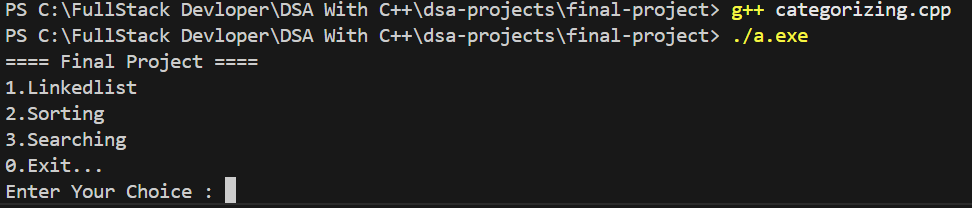

Output : In LinkedList

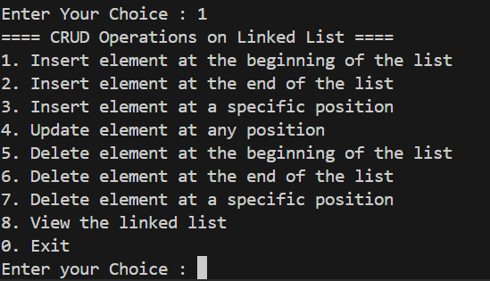

Output : Insert Node At begining

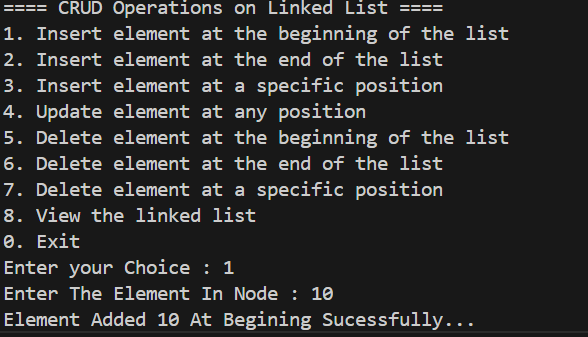

Output : Insert Node At Ending

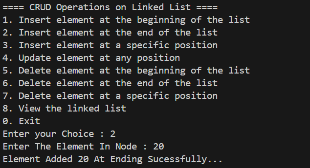

Output : Insert Node At Any Position

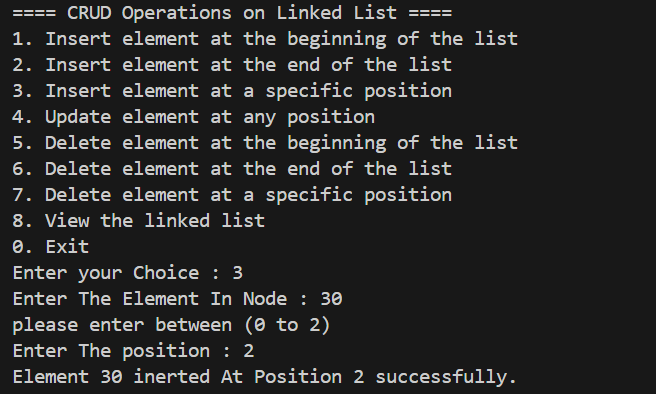

Output : Update At Any Position

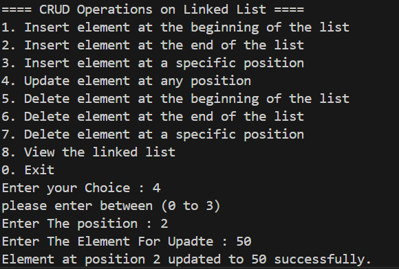

Output : Delete At Begining

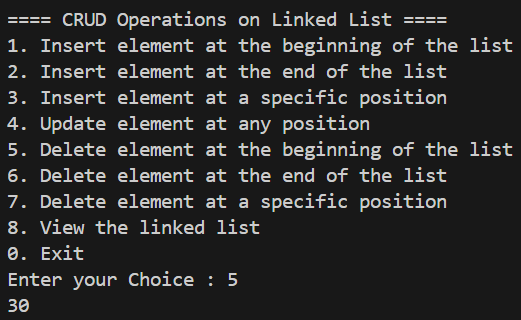

Output : Delete At Ending

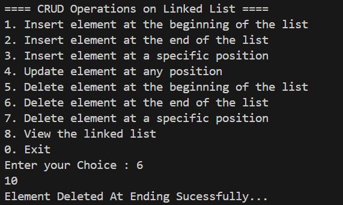

Output : Delete At Any Position

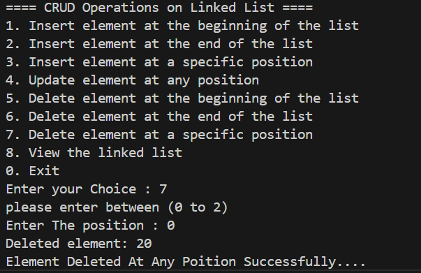

Output : View LinkedList

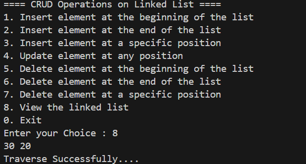

Output : Exiting LinkedList

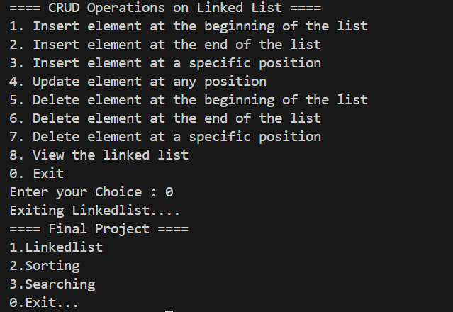

Output : Sorting

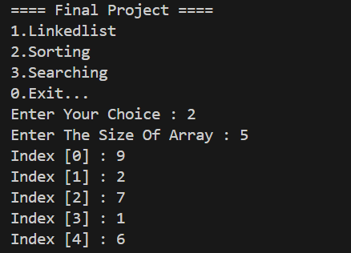

Output : Choosing Quick Sort

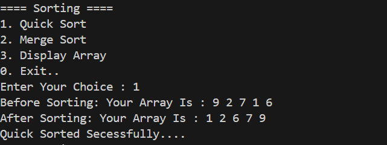

Output : Choosing Merge sort Showing Already sorted

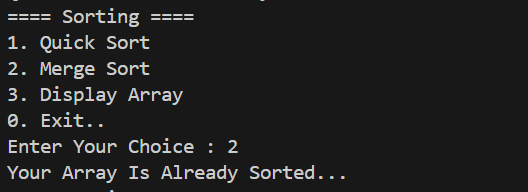

Output : Choosing Merge sort Again

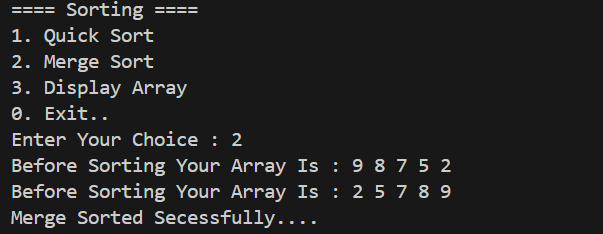

Output : View Array ...

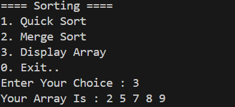

Output : Exiting Sorting ...

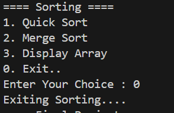

Output : Searching

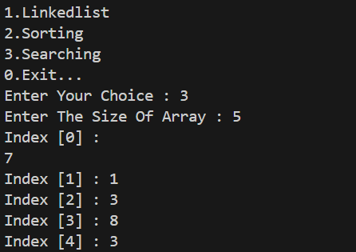

Output : Choosing Linear Search

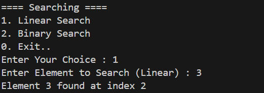

Output : Choosing Binary Search

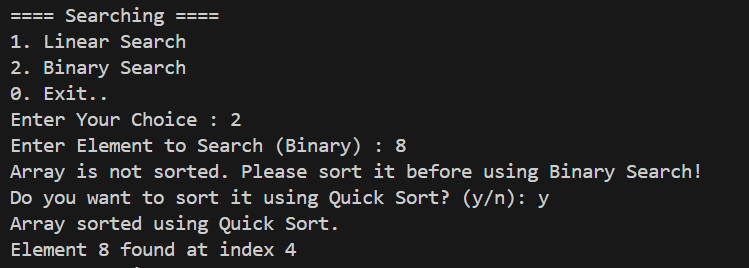

Output : Exiting Searching

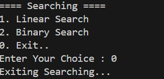

Output : Exiting Programme

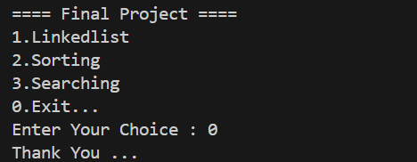
