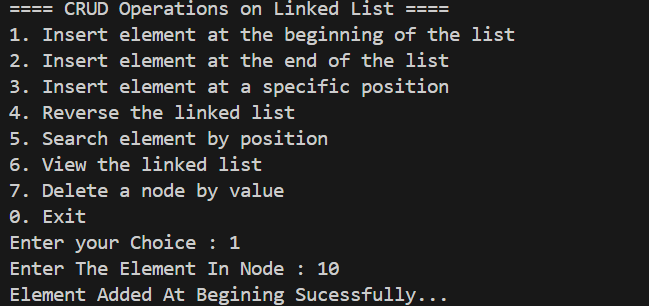
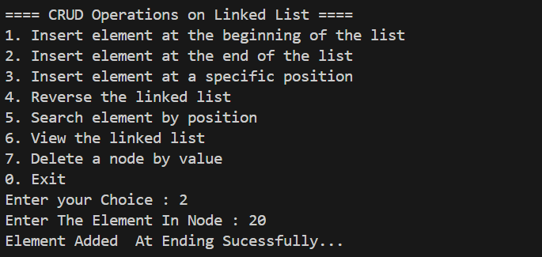
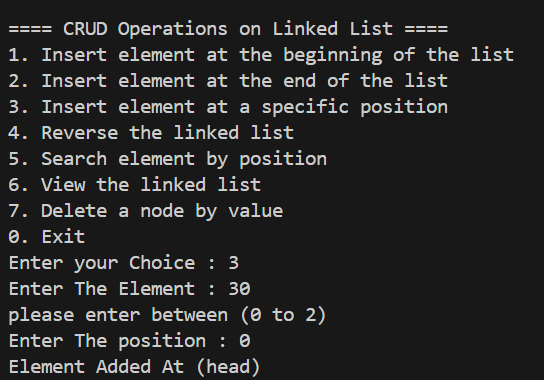
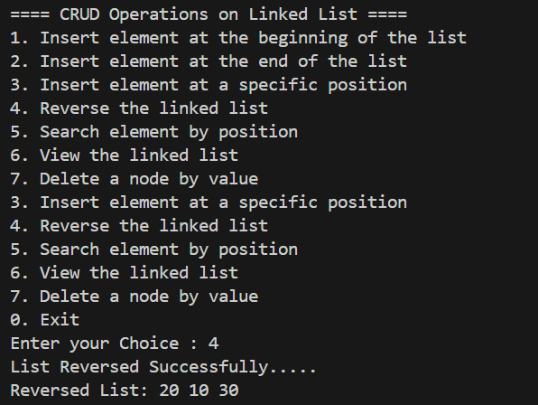
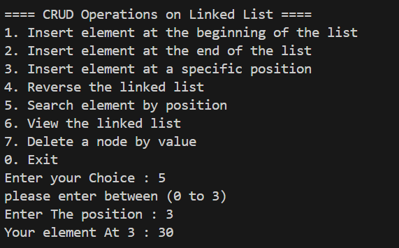
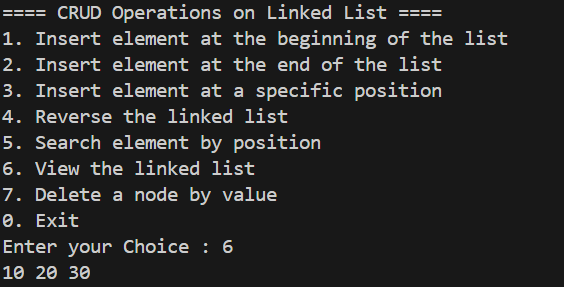
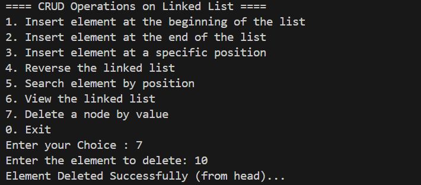
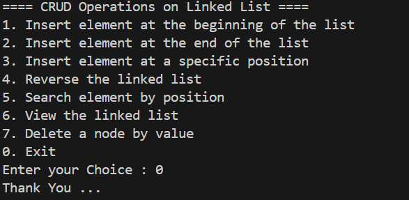

#  Project 8 Dynamic Data Allocation (Linked List)
##  Our Code
```cpp
#include <iostream>
using namespace std;

class Node
{
public:
    int data;
    Node *next;
};

class DMA
{
public:
    Node *Head = NULL;
    int count, position;

    DMA()
    {
        Head = NULL;
        count = 0;
    }

    void insertAtBegining(int ele)
    {
        Node *newNode = new Node();

        newNode->data = ele;
        newNode->next = Head;
        Head = newNode;
        this->count++;
        cout << "Element Added At Begining Sucessfully..." << endl;
    }

    void insertAtEnding(int ele)
    {
        Node *newNode = new Node();
        newNode->data = ele;
        newNode->next = NULL;

        if (Head == NULL)
        {
            Head = newNode;
        }
        else
        {
            Node *ptr = Head;

            while (ptr->next != NULL)
            {
                ptr = ptr->next;
            }
            ptr->next = newNode;
        }
        cout << "Element Added  At Ending Sucessfully..." << endl
             << endl;
        this->count++;
    }
    void insertAtPosition(int ele, int position)
    {

        if (position < 0 || position > count)
        {
            cout << "Invalid Postion... please enter between (0 to " << count << ")" << endl;
            return;
        }
        Node *newNode = new Node();

        if (position == 0)
        {
            newNode->data = ele;
            newNode->next = Head;
            Head = newNode;
            cout << "Element Added At (head)" << endl;
        }
        else
        {
            Node *ptr = Head;

            for (int i = 0; i < position - 1; i++)
            {
                ptr = ptr->next;
            }
            newNode->next = ptr->next;
            ptr->next = newNode;
            cout << "Element Added Successfully..." << endl;
        }

        this->count++;
    }
    void deleteByValue(int ele)
    {
        Node *ptr = Head;
        Node *prev = NULL;

        if (Head == NULL)
        {
            cout << "Your List Is Empty ... " << endl;
            return;
        }
        if (Head->data == ele)
        {
            Head = Head->next;
            delete ptr;
            this->count--;
            cout << "Element Deleted Successfully (from head)..." << endl;
            return;
        }

        else
        {

            while (ptr != NULL && ptr->data != ele)
            {
                prev = ptr;
                ptr = ptr->next;
            }
            if (ptr == NULL)
            {
                cout << "Element Not Found In The List..." << endl;
                return;
            }
            prev->next = ptr->next;
            delete ptr;
            this->count--;
            cout << "Element Deleted Successfully..." << endl;
        }
    }
    void reverseList()
    {
        Node *ptr = Head;
        Node *prev = NULL;
        Node *next = NULL;

        if (ptr == NULL)
        {
            cout << "Your List Is Empty ... ";
        }
        else
        {
            while (ptr != NULL)
            {
                next = ptr->next;
                ptr->next = prev;
                prev = ptr;
                ptr = next;
            }
            Head = prev;

            cout << "List Reversed Successfully....." << endl;
            cout << "Reversed List: ";
            viewList();
        }
    }

    void searchElement(int position)
    {
        Node *ptr = Head;

        if (Head == NULL)
        {
            cout << "Your List Is Empty..." << endl;
        }
        else if (position <= 0 || position > this->count)
        {
            cout << "Invalid Position ..." << endl;
            return;
        }
        else
        {
            for (int i = 1; i < position; i++)
            {
                ptr = ptr->next;
            }

            cout << "Your element At " << position << " : " << ptr->data << endl
                 << endl;
        }
    }
    void viewList()
    {

        Node *ptr = Head;

        if (ptr == NULL)
        {
            cout << "Your List Is Empty ... " << endl;
        }
        else
        {
            while (ptr != NULL)
            {
                cout << ptr->data << " ";
                ptr = ptr->next;
            }
        }

        cout << endl;
    }
};

int main()
{

    DMA list;

    int choice, ele, position;

    do
    {
        cout << "==== CRUD Operations on Linked List ====" << endl;
        cout << "1. Insert element at the beginning of the list" << endl;
        cout << "2. Insert element at the end of the list" << endl;
        cout << "3. Insert element at a specific position" << endl;
        cout << "4. Reverse the linked list" << endl;
        cout << "5. Search element by position" << endl;
        cout << "6. View the linked list" << endl;
        cout << "7. Delete a node by value" << endl;
        cout << "0. Exit" << endl;

        cout << "Enter your Choice : ";
        cin >> choice;

        switch (choice)
        {
        case 1:
            cout << "Enter The Element In Node : ";
            cin >> ele;
            list.insertAtBegining(ele);
            break;
        case 2:
            cout << "Enter The Element In Node : ";
            cin >> ele;
            list.insertAtEnding(ele);
            break;
        case 3:
            cout << "Enter The Element : ";
            cin >> ele;
            cout << "please enter between (0 to " << list.count << ")" << endl;
            cout << "Enter The position : ";
            cin >> position;
            list.insertAtPosition(ele, position);
            break;
        case 4:
            list.reverseList();
            break;
        case 5:
            cout << "please enter between (1 to " << list.count << ")" << endl;
            cout << "Enter The position : ";
            cin >> position;
            list.searchElement(position);
            break;
        case 6:
            list.viewList();
            break;
        case 7:
            cout << "Enter the element to delete: ";
            cin >> ele;
            list.deleteByValue(ele);
            break;
        case 0:
            cout << "Thank You ..." << endl;
            break;

        default:
            cout << "Invalid Choice Please Try Again..." << endl;
            break;
        }

    } while (choice != 0);

    return 0;
}


```
## 📸 Sample Output Screenshot

Below is an actual run of the program in the terminal:

Output : Insert Node At begining



Output : Insert Node At Ending



Output : Insert Node At Any Position



Output : Reverse Linked List



Output : Search Element By postion



Output : View Linked List



Output : Delete Node By Value



Output : Exit..




