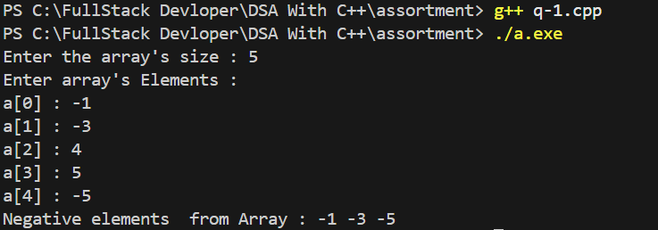
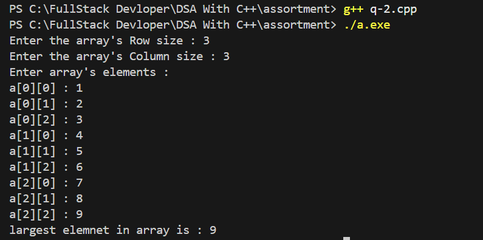
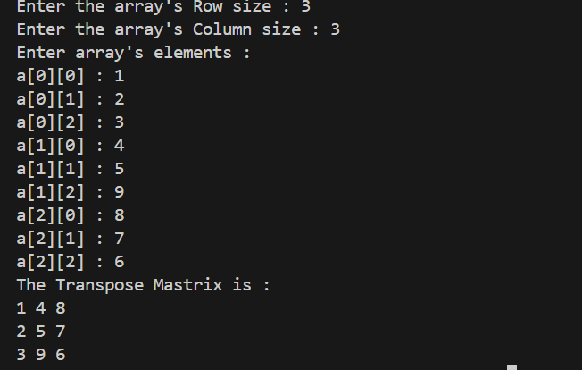
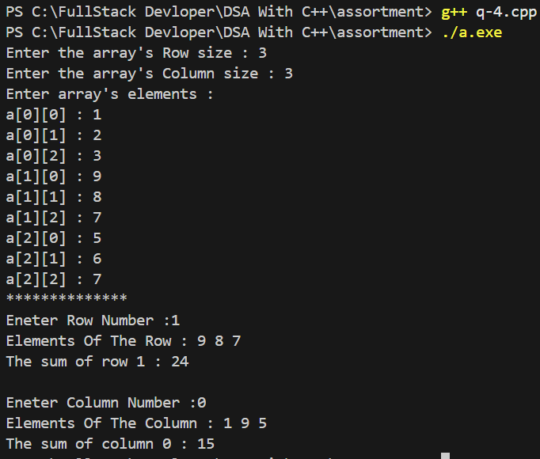

#  Project 3 Assortment

## Q.1 Negative Elements in 1D Array

##  Our Code
```cpp
#include<iostream>
using namespace std;

int main(){

    int size , i;
    int a[5];

    cout << "Enter the array's size : ";
    cin >> size;

    for ( i = 0; i < size; i++)
    {
        cout << "Enter the element of array : ";
        cin >> a[i];

    }
    cout << "Negative elements  from Array : ";
    for ( i = 0; i < size; i++)
    {
        if (a[i] < 0)
        {
            cout << a[i] << " ";
        }
    }
    return 0;
}

```
## 📸 Sample Output Screenshot

Below is an actual run of the program in the terminal:

Output:




## Q.2 Largesst Element In 2D Array.

##  Our Code
```cpp

#include<iostream>
using namespace std;

int main(){

    int row, column , i ,j;
    int a[5][5];

    cout << "Enter the array's Row size : ";
    cin >> row;

    cout << "Enter the array's Column size : ";
    cin >> column;

    cout << "Enter array's elements : " << endl;
    for ( i = 0; i < row; i++)
    {
        for ( j = 0; j < column; j++)
        {
            cout << "a["<< i <<"]"<< "[" << j <<"]" <<" : ";
            cin >> a[i][j];
        }
    }

    for ( i = 0; i < row; i++)
    {
        for ( j = 0; j < column; j++)
        {
            if (a[i][j] > a[0][0])
            {
                a[0][0] = a[i][j];
            }
        }
    }
    cout << "largest elemnet in array is : " << a[0][0] << endl;  
    return 0;
}

```
## 📸 Sample Output Screenshot

Below is an actual run of the program in the terminal:

Output:




## Q.3 Transpose Of 2D Array.

##  Our Code
```cpp

#include<iostream>
using namespace std;

int main(){

    int row, column , i ,j;
    int a[5][5];

    cout << "Enter the array's Row size : ";
    cin >> row;

    cout << "Enter the array's Column size : ";
    cin >> column;

    cout << "Enter array's elements : " << endl;
    for ( i = 0; i < row; i++)
    {
        for ( j = 0; j < column; j++)
        {
            cout << "a["<< i <<"]"<< "[" << j <<"]" <<" : ";
            cin >> a[i][j];
        }
    }
    cout << "The Transpose Mastrix is : " << endl;
    for ( j = 0; j < row; j++)
    {
        for ( i = 0; i < column; i++)
        {
            cout << a[i][j] << " " ;
            
        }
        cout << endl;
    }
    return 0;
}


```
## 📸 Sample Output Screenshot

Below is an actual run of the program in the terminal:

Output:




## Q.4 Sum of Elements in Row & Column of 2D Array.


##  Our Code
```cpp

#include<iostream>
using namespace std;

int main(){

    int row, column , i ,j;

    cout << "Enter the array's Row size : ";
    cin >> row;

    cout << "Enter the array's Column size : ";
    cin >> column;

    int a[row][column];

    cout << "Enter array's elements : " << endl;
    for ( i = 0; i < row; i++)
    {
        for ( j = 0; j < column; j++)
        {
            cout << "a["<< i <<"]"<< "[" << j <<"]" <<" : ";
            cin >> a[i][j];
        }
    }
    cout << "**************"<< endl;
    int row_num;

    cout << "Eneter Row Number :" ;
    cin >> row_num;

    cout<< "Elements Of The Row : ";
    for ( j = 0; j < column; j++)
    {
        cout << a[row_num][j] << " ";
    }
    cout << endl;

    int row_sum = 0;

    for ( j = 0; j < column; j++)
    {
        row_sum += a[row_num][j];
    }
    cout << "The sum of row " << row_num << " : " << row_sum << endl;
    cout << endl;

    int col_num;

    cout << "Eneter Column Number :" ;
    cin >> col_num;

    cout<< "Elements Of The Column : ";
    for (i = 0; i < row; i++) 
    {
        cout << a[i][col_num] << " ";
    }
    cout << endl;

    int col_sum = 0;

    for ( i = 0; i < row; i++)
    {
        col_sum += a[i][col_num];
    }
    cout << "The sum of column " << col_num << " : " << col_sum << endl;
    return 0;
    
}

```
## 📸 Sample Output Screenshot

Below is an actual run of the program in the terminal:

Output:




