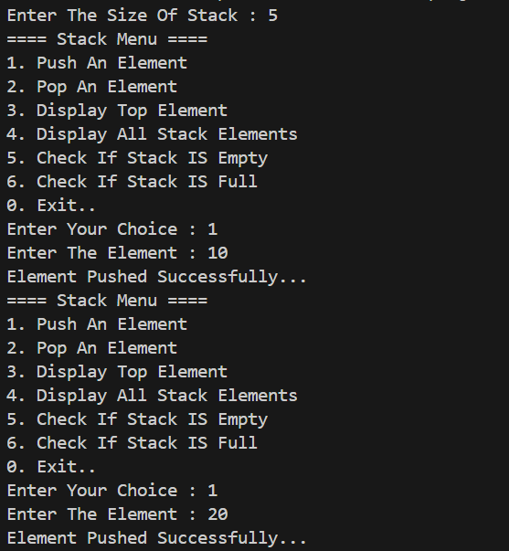
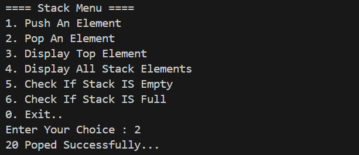
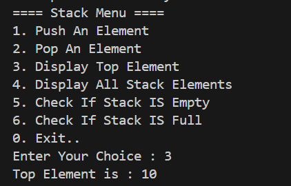
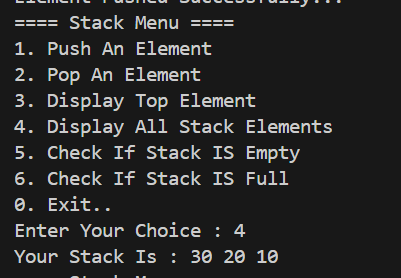
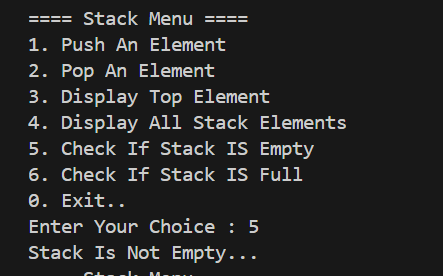
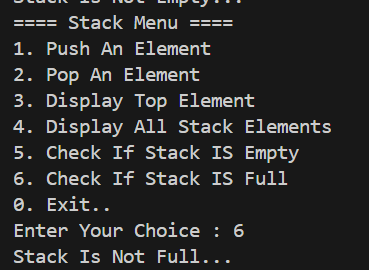
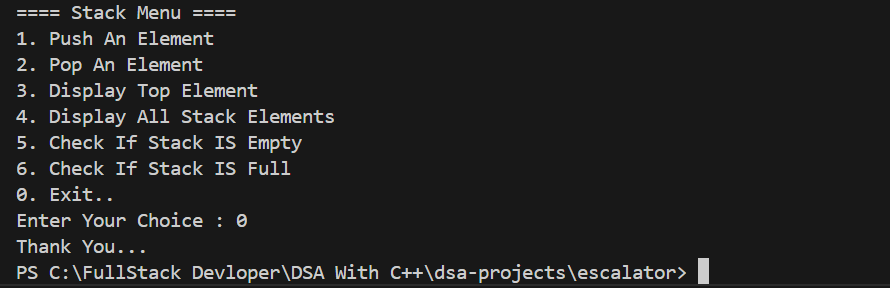

#  Project 9 : Escalator (Stack)
##  Our Code
```cpp
#include <iostream>
using namespace std;

class Stack
{
public:
    virtual void Push(int ele) = 0;
    virtual void Pop() = 0;
    virtual void Top() = 0;
    virtual void Display() = 0;
    virtual void isEmpty() = 0;
    virtual void isFull() = 0;
    virtual ~Stack() {}
};

class StackMethods : public Stack
{

private:
    int *arr;
    int size;
    int top;

public:
    StackMethods(int size)
    {
        this->size = size;
        arr = new int[size];
        top = -1;
    }

    void Push(int ele) override
    {

        if (top == size - 1)
        {
            cout << "Stack Is Full..." << endl;
        }
        else
        {
            top++;
            arr[top] = ele;
            cout << "Element Pushed Successfully..." << endl;
        }
    }
    void Pop() override
    {
        
        if (top == -1)
        {
            cout << "Stack Is Empty..." << endl;
        }
        else
        { 
            cout  << arr[top]<< " Poped Successfully..." << endl;
            top--;
        }
    }
    void Top() override
    {
        if (top == -1)
        {
            cout << "Stack Is Empty..." << endl;
        }
        else
        { 
            cout << "Top Element is : " << arr[top] << endl;
        }
    }
    void Display() override
    {
        if (top == -1)
        {
            cout << "Stack Is Full..." << endl;
        }
        else
        {
            cout << "Your Stack Is : ";

            for (int i = top; i >= 0; i--)
            {
                cout << arr[i] << " ";
            }
            cout << endl;
        }
    }
    void isEmpty() override
    {
        if (top == -1)
        {
            cout << "Stack Is Empty...." << endl;
        }
        else{
            cout << "Stack Is Not Empty..." << endl;
        }
    }
    void isFull() override
    {
        if (top == size -1)
        {
            cout << "Stack Is Full...." << endl;
        }
        else{
            cout << "Stack Is Not Full..." << endl;
        }
    }
    ~StackMethods()
    {
        delete[] arr;
    }
};

int main()
{

    int choice, size, element;

    cout << "Enter The Size Of Stack : ";
    cin >> size;

    Stack *stack = new StackMethods(size);

    do
    {
        cout << "==== Stack Menu ====" << endl;
        cout << "1. Push An Element " << endl;
        cout << "2. Pop An Element " << endl;
        cout << "3. Display Top Element " << endl;
        cout << "4. Display All Stack Elements" << endl;
        cout << "5. Check If Stack IS Empty" << endl;
        cout << "6. Check If Stack IS Full" << endl;
        cout << "0. Exit.." << endl;

        cout << "Enter Your Choice : ";
        cin >> choice;

        switch (choice)
        {
        case 1:

            cout << "Enter The Element : ";
            cin >> element;

            stack->Push(element);

            break;
        case 2:

            stack->Pop();

            break;
        case 3:

            stack->Top();

            break;
        case 4:

            stack->Display();

            break;
        case 5:

            stack->isEmpty();

            break;
        case 6:

            stack->isFull();

            break;
        case 0:

            cout << "Thank You..." << endl;

            break;

        default:
            cout << "Invalid Choice...Please try Again..."<< endl;
            break;
        }
    } while (choice != 0);

    return 0;
}


```
## 📸 Sample Output Screenshot

Below is an actual run of the program in the terminal:

1.Push An Element 

Output : 



2.Pop An Element 

Output : 



3.Display Top Element 

Output : 



4.Display All Stack Element

Output : 



5.Check If Stack IS Empty

Output : 



6.Check If Stack IS Full 

Output : 



0.Exit..

Output : 




