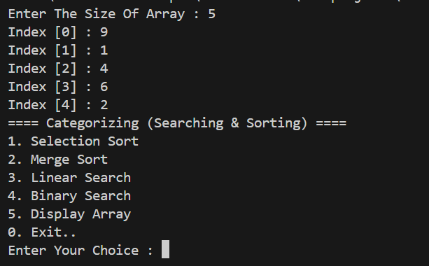
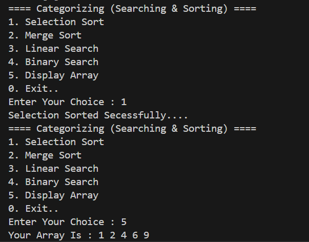
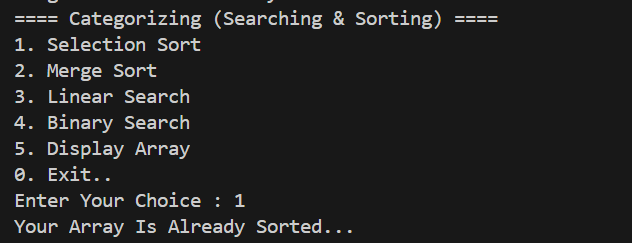
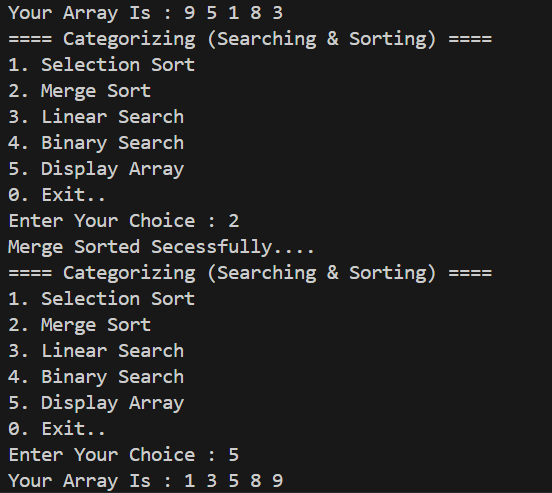
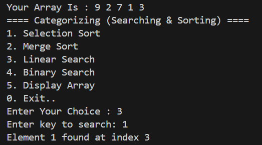
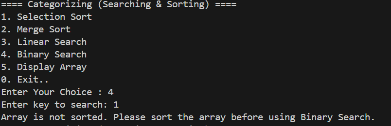
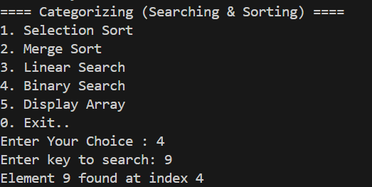
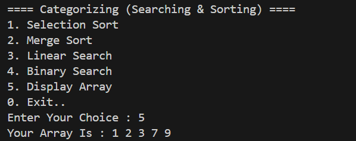
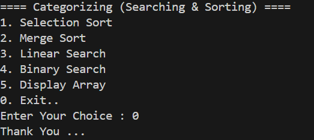

## Project 10 : Categorizing (Sorting & Searching)

This is a simple C++ console-based application for demonstrating **Sorting** and **Searching** algorithms using an array. It allows the user to input data and then apply various algorithms interactively.

---

## Features

- Selection Sort
- Merge Sort
- Linear Search
- Binary Search with sorted check  
- Array Display
- Avoids re-sorting  
- Clean, menu-driven program
- Validation: Checks if array is sorted before applying Binary Search

---

## Overview

This C++ program allows users to:
- Perform **sorting** (Selection Sort & Merge Sort)
- Perform **searching** (Linear Search & Binary Search)
- **Display** the current array
- Check if the array is already sorted before sorting or binary searching

---

## Algorithms Implemented

| Algorithm        | Type        | Description                                         |
|------------------|-------------|-----------------------------------------------------|
| Selection Sort   | Sorting     | Selects the smallest element and places it in order|
| Merge Sort       | Sorting     | Divide-and-conquer based efficient sorting         |
| Linear Search    | Searching   | Searches each element one by one                   |
| Binary Search    | Searching   | Searches by dividing the sorted array              |

---
## Functions

| Function         | Description                                           |
|------------------|-------------------------------------------------------|
| `slectionSort()` | Sorts array using selection sort                      |
| `mergeSort()`    | Sorts array using recursive merge sort                |
| `merge()`        | Helper to merge two sorted subarrays                  |
| `linearSearch()` | Finds element by linear search                        |
| `binarySearch()` | Searches key using binary search (sorted check added) |
| `isSorted()`     | Returns true if array is sorted in ascending order    |
| `display()`      | Prints the current array                              |

---
## Our Code

```cpp

#include<iostream>
using namespace std;

void slectionSort(int arr[], int size){

    for (int i = 0; i < size; i++)
    {
        int min = i;
        for (int j = i + 1; j < size; j++)
        {
            if (arr[j] < arr[min])
            {
                min = j;
            }
        }
        int temp = arr[min];
        arr[min] = arr[i];
        arr[i] = temp;   
    }
};
void merge(int arr[], int low ,int mid ,int high){

    int left = mid - low + 1;
    int right = high - mid;

    int a[left],b[right];

    for (int i = 0; i < left; i++)
    {
        a[i] = arr[low + i];
    }
    for (int i = 0; i < right; i++)
    {
        b[i] = arr[(mid+1) + i];
    }

    int i = 0, j = 0, k = low;

    while (i < left && j < right)
    {
        if (a[i] < b[j])
        {
            arr[k++] = a[i++];
        }
        else
        {
            arr[k++] = b[j++];
        }
    }
    while (i < left)
    {
        arr[k++] = a[i++];
    }
    while (j < right)
    {
        arr[k++] = b[j++];
    }

};
void mergeSort(int arr[], int low, int high){
    if (low < high)
    {
        int mid = (low + high) / 2;

        mergeSort(arr,low,mid);

        mergeSort(arr,mid+1 ,high);

        merge(arr,low,mid,high);

    }

};
void linearSearch(int arr[],int size, int key){

    for (int i = 0; i < size; i++)
    {
        if (arr[i] == key)
        {
            cout << "Element " <<  arr[i] << " found at index " << i << endl;
            return;
        }
    }
    cout << "Element Not found...!" << endl;

};
bool isSorted(int arr[], int size) {
    for (int i = 0; i < size - 1; i++) {
        if (arr[i] > arr[i + 1]) {
            return false;
        }
    }
    return true;
};

void binarySearch(int arr[], int size , int key){

    if (!isSorted(arr, size)) {
        cout << "Array is not sorted. Please sort the array before using Binary Search." << endl;
        return;
    }

    int low = 0, high = size - 1;

    while (low <= high)
    {
        int mid = (low + high) / 2;

        if (arr[mid] == key)
        {
            cout << "Element " << arr[mid] << " found at index " << mid << endl;
            return;
        }
        else if (arr[mid] < key) {
            low = mid + 1;
        }
        else {
            high = mid - 1;
        }
    }
};

void display(int arr[],int size){
    cout << "Your Array Is : ";

    for (int i = 0; i < size; i++)
    {
        cout << arr[i] << " ";
    }
    cout << endl;
}

int main (){

    int size,choice,key;

    cout << "Enter The Size Of Array : ";
    cin >> size;

    int arr[size];

    for (int i = 0; i < size; i++)
    {
        cout << "Index [" << i << "] : ";
        cin >> arr[i];
    }
    do
    {
        cout << "==== Categorizing (Searching & Sorting) ====" << endl;
        cout << "1. Selection Sort" << endl;
        cout << "2. Merge Sort" << endl;
        cout << "3. Linear Search" << endl;
        cout << "4. Binary Search" << endl;
        cout << "5. Display Array" << endl;
        cout << "0. Exit.." << endl;

        cout << "Enter Your Choice : ";
        cin >> choice;

        switch (choice)
        {
        case 1:
            if (isSorted(arr,size))
            {
            cout << "Your Array Is Already Sorted..." << endl;
            }
            else{
            slectionSort(arr,size);
            cout << "Selection Sorted Secessfully...." << endl;
            }
            break;
        case 2:
            if (isSorted(arr,size))
            {
            cout << "Your Array Is Already Sorted..." << endl;
            }
            else{
            mergeSort(arr,0,size-1);
            cout << "Merge Sorted Secessfully...." << endl;
            }
            

            break;
        case 3:
            cout << "Enter key to search: ";
            cin >> key;
            linearSearch(arr,size,key);
            break;
        case 4:
            cout << "Enter key to search: ";
            cin >> key;
            binarySearch(arr,size,key);
            break;
        case 5:
            display(arr,size);
            break;
        case 0:
            cout << "Thank You ... "<< endl;
            break;
        default:
            cout << "Invalid Choice ..!" << endl;
            break;
        }
        

    } while (choice != 0);

    return 0;
}
```

## 📸 Sample Output Screenshot

Below is an actual run of the program in the terminal:

1.Insert Array 

Output : 



2.Selection Sort

Output : 



if Alerdy Sorted...



3.Merge Sort

Output : 



if Alerdy Sorted...


4.Linear Seach( No need Sorted Array )

Output : 



5.Binary Search If Array Is Not Sorted...

Output :



If Array is sorted...

Output : 



6.Display Array

Output : 



0.Exit..

Output : 


