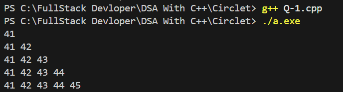
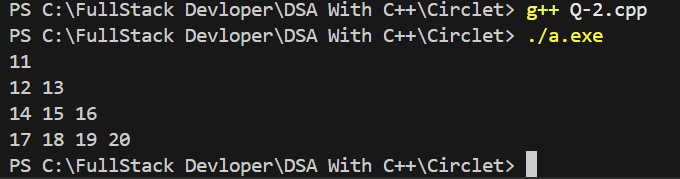
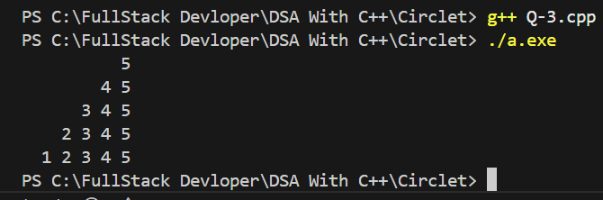
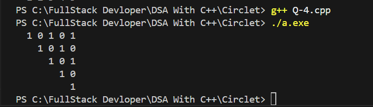
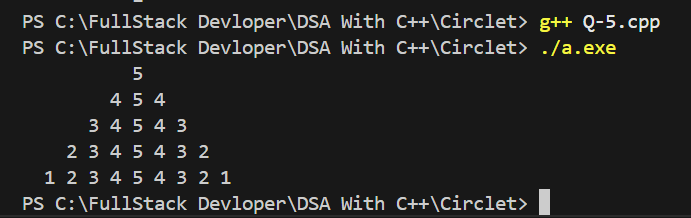
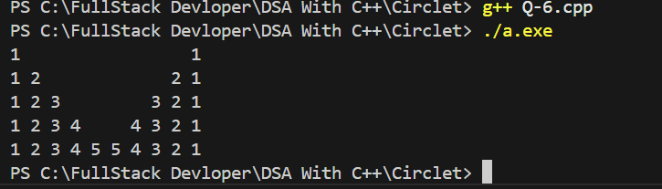
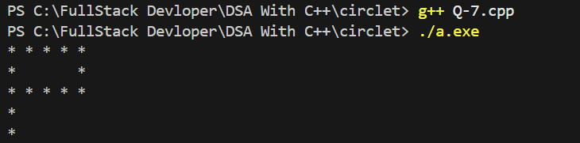

#  Project 3 Circlet

## Q.1 Develop a program that prints the given Right half triangle pattern using a nested for loop.

##  Our Code
```cpp

#include<iostream>
using namespace std;    

int main(){
    int i, j;

    for ( i = 41; i <= 45; i++)
    {
        for ( j = 41; j <= i; j++)
        {
            cout << j << " ";
        }
        cout << endl;
    }
    return 0;
    
}

```
## 📸 Sample Output Screenshot

Below is an actual run of the program in the terminal:

Output:




## Q.2 Develop a program that prints the given Floyd’s triangle pattern using a nested for loop.

##  Our Code
```cpp

#include<iostream>
using namespace std;    

int main(){
    int i, j;
    int num=11;

    for ( i = 1; i <= 4; i++)
    {
        for ( j = 1; j <= i; j++)
        {
            cout << num << " ";
            num++;
        }
        cout << endl;
    }
    return 0;
    
}


```
## 📸 Sample Output Screenshot

Below is an actual run of the program in the terminal:

Output:




## Q.3 Develop a program that prints the given Left half triangle pattern using a nested for loop.

##  Our Code
```cpp

#include<iostream>
using namespace std;    

int main(){
    int i, j,k;

    for ( i = 5; i >= 1; i--)
    {
        for ( k = 1; k <= i; k++)
        {
            cout << "  ";
        }
        
        for ( j = i; j <= 5; j++)
        {
            cout << j << " ";
        }
        cout << endl;
    }
    return 0;
    
}


```
## 📸 Sample Output Screenshot

Below is an actual run of the program in the terminal:

Output:




## Q.4 Develop a program that prints the given Inverted Left half triangle pattern using a nested for loop.


##  Our Code
```cpp

#include<iostream>
using namespace std;    

int main(){
    int i ,j,k;


    for ( i = 5; i >= 1 ; i--)
    {
        for ( k = 5; k >=i; k--){
            cout << "  ";
        }
        int num=1;
        for (j = 1; j<= i; j++)
            {
                cout << num % 2 << " ";
                num++;
            }
        cout << endl;
    }
    return 0;
    
}

```
## 📸 Sample Output Screenshot

Below is an actual run of the program in the terminal:

Output:




## Q.5 Develop a program that prints the given Full Pyramid pattern using a nested for loop.

##  Our Code
```cpp

#include<iostream>
using namespace std;    

int main(){
    int i, j,k;

    for ( i = 5; i >= 1; i--)
    {
        for ( k = 1; k <= i; k++)
        {
            cout << "  ";
        }
        
        for ( j = i; j <= 5; j++)
        {
            cout << j << " ";
        }
        for ( j = 4; j >= i; j--)
        {
            cout << j << " ";
        }
        cout << endl;
    }
    return 0;
    
}


```
## 📸 Sample Output Screenshot

Below is an actual run of the program in the terminal:

Output:




## Q.6 Develop a program that prints the given Custom numeric pattern using a nested for loop.

##  Our Code
```cpp

#include<iostream>
using namespace std;    

int main(){
    int i, j,k;

    for ( i = 1; i <= 5; i++)
    {
        
        for ( j = 1; j <= i; j++)
        {
            cout << j << " ";
        }
        for ( k = 4; k >= i; k--)
        {
            cout << "    ";
        }
        for ( j = i; j >= 1; j--)
        {
            cout << j << " ";
        }
        cout << endl;
    }
    return 0;
    
}


```
## 📸 Sample Output Screenshot

Below is an actual run of the program in the terminal:

Output:




## Q.7 Develop a program that prints the given Custom alphabetic pattern using a nested for loop.

##  Our Code
```cpp

#include<iostream>
using namespace std;    

int main(){
    int i, j;

    for ( i = 1; i <= 5; i++)
    {
        if ( i ==1 || i == 3)
        {
            for ( j = 1; j <= 5; j++)
        {
            cout << "*" << " ";
        }
        }
        else if ( i == 2)
        {
            cout << "*       *";
        }
        else
        {
            cout << "*";
        }
        cout << endl;
    }
    return 0;
    
}


```
## 📸 Sample Output Screenshot

Below is an actual run of the program in the terminal:

Output:




